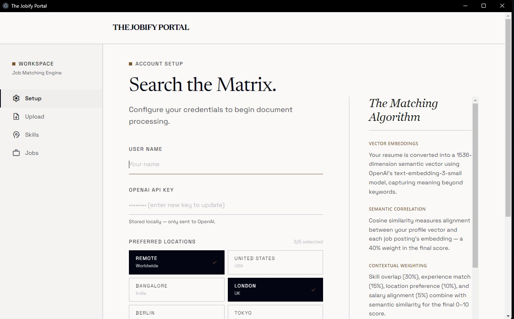
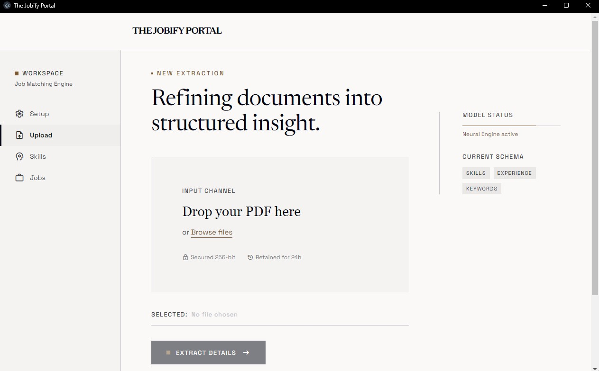
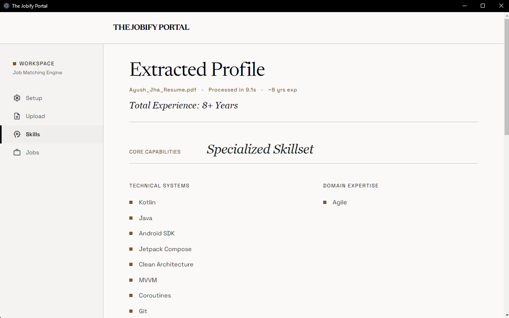
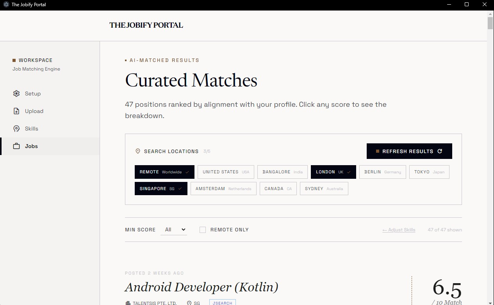

# The Jobify Portal

> A privacy-first desktop app that reads your resume, understands it semantically, and surfaces the jobs most aligned with who you actually are — not just what keywords you match.


---

## Table of Contents

- [Why This Tool in 2026](#why-this-tool-in-2026)
- [Features](#features)
- [Screenshots](#screenshots)
- [The Matching Algorithm](#the-matching-algorithm)
- [Tech Stack](#tech-stack)
- [Prerequisites](#prerequisites)
- [API Keys — What You Need and How to Get Them](#api-keys--what-you-need-and-how-to-get-them)
- [Installation](#installation)
- [Running in Development](#running-in-development)
- [Building for Production](#building-for-production)
- [Usage Guide](#usage-guide)
- [Project Structure](#project-structure)
- [Data Privacy](#data-privacy)
- [Contributing](#contributing)

---

## Why This Tool in 2026

The job market in 2026 is noisier than ever. AI-generated job postings flood every board. Mass-apply tools have flooded recruiters' inboxes with thousands of identical applications. Generic keyword matching returns hundreds of irrelevant results.

**The Jobify Portal takes the opposite approach:**

- **Semantic understanding over keyword matching.** Your resume is converted into a 1536-dimensional vector that captures the _meaning_ of your experience — not just the words. A job posting about "distributed infrastructure" will match a resume describing "building scalable microservices" even if those exact words never overlap.

- **Your data stays on your machine.** No account, no cloud storage, no analytics pipeline. Everything — your resume text, extracted profile, job results, and API keys — is stored locally in your OS app data directory using `electron-store`. The only outbound calls are to the APIs you configure.

- **Multi-region, multi-source.** Search Bangalore, Berlin, Tokyo, London, and remote simultaneously from four independent job sources in a single click.

- **Refinement without re-fetching.** Toggle individual skills on the Skills screen to adjust your profile weight without burning API quota on another job fetch round-trip.

At a time when most job tools optimize for volume, this tool optimizes for precision.

---

## Features

- **Resume PDF parsing** — drag-and-drop or file picker, up to 10 MB
- **AI-powered profile extraction** — GPT-4o-mini extracts skills (technical + domain), work history, keywords, and years of experience as structured data
- **Semantic embeddings** — your profile is embedded with `text-embedding-3-small` (1536 dimensions) for deep semantic matching
- **Four job sources** — RemoteOK (free, no key), JSearch via RapidAPI, Adzuna, Reed UK
- **Up to 5 preferred locations** — per-location queries across all configured sources
- **Weighted hybrid scoring (0–10)** — cosine similarity + skill overlap + experience + location + salary
- **Score breakdown** — click any score to see the five-component breakdown
- **Skill toggle** — enable/disable individual skills before running a job search
- **In-page location refresh** — change target regions and re-run directly from the Jobs screen
- **Progressive screen unlock** — Upload unlocks after setup, Skills after extraction, Jobs after matching
- **Editorial design system** — Earth & Slate palette, Newsreader + Space Grotesk typography, sharp corners

---

## Screenshots

| Setup                                  | Upload                                   |
| -------------------------------------- | ---------------------------------------- |
|  |  |

| Skills                                   | Jobs                                 |
| ---------------------------------------- | ------------------------------------ |
|  |  |

---

## The Matching Algorithm

Every job is scored 0–10 using a **weighted hybrid model** that combines five signals:

```
Score = (Semantic × 0.40) + (Skill Overlap × 0.30) + (Experience × 0.15) + (Location × 0.10) + (Salary × 0.05)
```

### Signal Breakdown

#### 1. Semantic Similarity (40%)

Both your resume profile and the job description are embedded using OpenAI's `text-embedding-3-small` model into 1536-dimensional vectors. The **cosine similarity** between these vectors is computed:

```
cosine(A, B) = (A · B) / (|A| × |B|)
```

This captures conceptual alignment — "distributed systems architect" and "platform infrastructure lead" will score high even with zero keyword overlap.

#### 2. Skill Overlap (30%)

The ratio of your active (enabled) skills that appear in the job title and description:

```
Skill Overlap = matched_skills / total_active_skills
```

You can toggle skills on the Skills screen to recalibrate this signal before running a search.

#### 3. Experience Match (15%)

A binary/heuristic signal based on whether your extracted years of experience is above zero. Returns `1.0` for profiles with work history, `0.6` for profiles where experience could not be determined.

#### 4. Location Match (10%)

Remote jobs score `1.0`. On-site or hybrid jobs score `0.7`. This rewards remote-eligible roles while still surfacing strong on-site matches.

#### 5. Salary Alignment (5%)

Jobs that include a salary range score `0.85`. Jobs with no salary data score `0.5`. This is a low-weight signal that gently ranks transparent job postings higher.

### Why These Weights?

The weights reflect a deliberate priority ordering:

- **Semantic and skill signals together account for 70%.** These are the two most reliable indicators of genuine fit.
- **Experience (15%) is a tiebreaker**, not a filter. The app does not hard-reject jobs based on years of experience.
- **Location (10%) favors flexibility** but never excludes. A perfect-fit on-site role in Berlin will still surface for a candidate who prefers remote.
- **Salary (5%) is a transparency signal.** The app cannot evaluate salary fit without knowing the candidate's expectations, so this is kept minimal.

---

## Tech Stack

| Layer           | Technology                                             |
| --------------- | ------------------------------------------------------ |
| Desktop shell   | Electron 30                                            |
| Frontend        | React 18 + TypeScript 5.6                              |
| Build tooling   | Vite 5 + vite-plugin-electron                          |
| Styling         | Tailwind CSS 3                                         |
| Routing         | React Router 6                                         |
| PDF parsing     | pdf-parse                                              |
| AI / Embeddings | OpenAI SDK (`gpt-4o-mini`, `text-embedding-3-small`)   |
| Local storage   | electron-store (JSON, OS app data dir)                 |
| Job sources     | RemoteOK API, JSearch (RapidAPI), Adzuna API, Reed API |

---

## Prerequisites

Before installing, make sure you have the following on your system:

### Required

| Requirement                    | Minimum Version | Check            |
| ------------------------------ | --------------- | ---------------- |
| [Node.js](https://nodejs.org/) | 18.0.0          | `node --version` |
| npm                            | 9.0.0           | `npm --version`  |
| Git                            | Any             | `git --version`  |

> **Note:** Node 18 is required because the main process uses the built-in `fetch` API and native ESM modules. Node 16 will not work.

### Operating System

| Platform              | Support            |
| --------------------- | ------------------ |
| Windows 10 / 11       | ✅ Fully supported |
| macOS 12+             | ✅ Fully supported |
| Linux (Ubuntu 20.04+) | ✅ Supported       |

---

## API Keys — What You Need and How to Get Them

### 1. OpenAI API Key — **Required**

Used for: resume profile extraction (GPT-4o-mini) and generating semantic embeddings (text-embedding-3-small).

**Estimated cost for personal use:** Under $0.10 per resume extraction. Embedding calls are fractions of a cent each.

**Steps to get your key:**

1. Go to [platform.openai.com](https://platform.openai.com)
2. Sign in or create an account
3. Click your profile icon → **API keys**
4. Click **Create new secret key** — give it a name like "Jobify Portal"
5. Copy the key immediately (it will not be shown again)
6. Add a payment method under **Billing** — OpenAI requires a payment method even on the free tier
7. Paste the key into The Jobify Portal → Setup screen → **OpenAI API Key**

> Your key is stored locally in your OS app data folder and is only ever sent to `api.openai.com`.

---

### 2. RapidAPI Key (JSearch) — **Optional**

Used for: global job listings aggregated from LinkedIn, Indeed, Glassdoor, and more. Supports location-specific queries (e.g. "React developer in Bangalore, India").

**Free tier:** 200 requests/month. Each search uses 1–3 requests depending on how many locations you select.

**Steps to get your key:**

1. Go to [rapidapi.com](https://rapidapi.com) and create a free account
2. Search for **"JSearch"** in the API marketplace
3. Click **Subscribe to Test** → select the **Basic (Free)** plan — 200 requests/month
4. Go to the **Endpoints** tab, find any endpoint, and copy the `X-RapidAPI-Key` value shown in the code snippet on the right
5. Paste into The Jobify Portal → Setup screen → **Additional Job Sources** → **RapidAPI Key**

> Without this key, only RemoteOK (remote-only jobs) will be searched.

---

### 3. Adzuna API — **Optional**

Used for: regional job listings in UK, Germany, India, Japan, Canada, Australia, Netherlands, Singapore, and more.

**Free tier:** 250 requests/month.

**Steps to get your key:**

1. Go to [developer.adzuna.com](https://developer.adzuna.com)
2. Click **Register** and create a free account
3. After email verification, go to **Dashboard** → **API Access Details**
4. You will see an **App ID** and an **App Key** — copy both
5. Paste into The Jobify Portal → Setup screen → **Additional Job Sources**:
   - **Adzuna App ID** field
   - **Adzuna App Key** field

> Adzuna is the recommended optional key if you are searching outside the US, as it has strong coverage for India, Germany, and the UK.

---

### 4. Reed API Key — **Optional**

Used for: UK-specific job listings from [reed.co.uk](https://www.reed.co.uk), one of the UK's largest job boards. Only activated when **London, UK** is in your preferred locations.

**Free tier:** Generous free access for personal/non-commercial use.

**Steps to get your key:**

1. Go to [reed.co.uk/developers](https://www.reed.co.uk/developers/jobseeker)
2. Click **Register** to create a developer account
3. After registration, your API key is shown on the developer dashboard
4. Paste into The Jobify Portal → Setup screen → **Additional Job Sources** → **Reed API Key**

---

### Summary Table

| Key                | Required    | Free Tier                   | Best For                   |
| ------------------ | ----------- | --------------------------- | -------------------------- |
| OpenAI             | ✅ Yes      | Pay-per-use (~$0.10/resume) | Core functionality         |
| RapidAPI (JSearch) | ❌ Optional | 200 req/month               | Global coverage            |
| Adzuna             | ❌ Optional | 250 req/month               | India, Germany, UK, AU, JP |
| Reed               | ❌ Optional | Free                        | UK-only deep listings      |

---

## Installation

```bash
# 1. Clone the repository
git clone https://github.com/AJ-Dev-Labs/jobify.git
cd the-jobify-portal

# 2. Install dependencies
npm install
```

That's it. No `.env` file needed — all configuration is done through the app's Setup screen and stored securely in your OS app data directory.

---

## Running in Development

```bash
npm run dev
```

This starts:

- **Vite dev server** on `http://localhost:5173` (hot module replacement for the renderer)
- **Electron main process** watching for changes (rebuilds on save)
- The **Electron window** opens automatically

> The first startup may take 5–10 seconds while Vite and Electron both initialize.

---

## Building for Production

### Type check only

```bash
npx tsc --noEmit
```

### Production build (no installer)

```bash
npm run build
```

Outputs to:

- `dist/` — compiled renderer (React app)
- `dist-electron/` — compiled main process and preload

### Package as installable app

```bash
npm run package
```

This runs `electron-builder` and produces a platform-native installer in the `release/` folder:

| Platform | Output                |
| -------- | --------------------- |
| Windows  | `.exe` NSIS installer |
| macOS    | `.dmg` disk image     |
| Linux    | `.AppImage`           |

> **First-time packaging on macOS** may require Xcode Command Line Tools: `xcode-select --install`

> **Windows packaging** requires no additional tools beyond Node.js.

---

## Usage Guide

### Step 1 — Setup

1. Launch the app with `npm run dev` (or open the installed app)
2. On the **Setup** screen, enter:
   - Your name
   - Your OpenAI API key (validated live against the API)
   - Any optional job source keys (RapidAPI, Adzuna, Reed)
3. Select up to **5 preferred locations** from the location grid. These are saved immediately and used for all future job searches.
4. Click **Save & Initialize** — the key is validated before saving. If valid, the Upload screen unlocks.

### Step 2 — Upload Your Resume

1. Navigate to **Upload**
2. Drag and drop your resume PDF onto the drop zone, or click **Browse files**
   - Only PDF files are accepted
   - Maximum file size: 10 MB
3. Click **Extract Details**
4. Watch the three-step pipeline:
   - **Parsing PDF** — extracts raw text from your PDF
   - **Extracting profile with GPT-4o-mini** — identifies skills, experiences, and keywords
   - **Generating resume embedding** — converts your profile into a semantic vector
5. On success, the app navigates automatically to the Skills screen

### Step 3 — Review Your Profile

1. The **Skills** screen shows everything the AI extracted from your resume:
   - **Technical Systems** — programming languages, frameworks, tools, platforms
   - **Domain Expertise** — methodologies, leadership, business skills
   - **Career Narrative** — work history with dates, titles, companies, and descriptions
   - **Extracted Keywords** — key terms from your resume (primary and secondary)
2. **Click any skill or keyword to toggle it off** — disabled items are excluded from the skill overlap calculation when scoring jobs. Use this to focus the search on specific competencies.
3. When ready, click **Find Matching Jobs**

### Step 4 — Browse Curated Matches

1. The **Jobs** screen fetches from all configured sources simultaneously and scores every result
2. Jobs are ranked **highest score first**
3. Use the **location chips** at the top to change target regions — click **Apply & Refresh** to re-run with the new selection
4. Use **Min Score** and **Remote Only** filters to narrow results
5. Click any **score number** to expand the five-component breakdown
6. Click **Apply to Job →** to open the job listing in your default browser
7. Click **← Adjust Skills** to return to the Skills screen and toggle different competencies before refreshing again

---

## Project Structure

```
the-jobify-portal/
├── src/
│   ├── main/                        # Electron main process (Node.js)
│   │   ├── main.ts                  # App entry, window creation
│   │   ├── store.ts                 # electron-store singleton
│   │   ├── preload.ts               # contextBridge IPC bindings
│   │   └── handlers/
│   │       ├── config.ts            # Config CRUD + OpenAI key validation
│   │       ├── pdf.ts               # File picker, PDF parsing, AI extraction, embedding
│   │       ├── profile.ts           # Profile read/write/list
│   │       └── jobs.ts              # Fetch (4 sources), score, store
│   ├── renderer/                    # React app (browser context)
│   │   ├── screens/
│   │   │   ├── SetupScreen.tsx      # Credentials + location picker
│   │   │   ├── UploadScreen.tsx     # Dropzone + pipeline progress
│   │   │   ├── SkillsScreen.tsx     # Profile display + skill toggles
│   │   │   └── JobsScreen.tsx       # Job list + location refresh + score breakdown
│   │   ├── components/
│   │   │   ├── Shell.tsx            # App layout wrapper
│   │   │   ├── Header.tsx           # Top brand bar
│   │   │   └── Sidebar.tsx          # Navigation with progressive unlock
│   │   ├── hooks/
│   │   │   └── useAppState.tsx      # Unlock state, reads store on mount
│   │   ├── styles/
│   │   │   └── globals.css          # Tailwind + pulse-dot animation
│   │   ├── router.tsx               # Route definitions
│   │   └── App.tsx                  # Root with HashRouter + AppStateProvider
│   └── shared/
│       └── types.ts                 # All shared TypeScript interfaces
├── designdocs/                      # Per-screen design specifications
├── electron.d.ts                    # window.electronAPI type declaration
├── tailwind.config.ts               # Earth & Slate design tokens
├── vite.config.ts                   # Vite + Electron build config
├── tsconfig.json                    # TypeScript config (renderer + shared)
├── tsconfig.node.json               # TypeScript config (main process)
└── PROJECT_CONTEXT.md               # Living progress tracker
```

---

## Data Privacy

All data processed by this app stays on your machine:

| Data                                   | Where it lives                      | Leaves your machine?                                |
| -------------------------------------- | ----------------------------------- | --------------------------------------------------- |
| Resume PDF                             | Only read temporarily, never copied | No                                                  |
| Extracted profile (skills, experience) | `electron-store` in OS app data     | No                                                  |
| Resume embedding vector                | `electron-store` in OS app data     | No                                                  |
| Job results + scores                   | `electron-store` in OS app data     | No                                                  |
| API keys                               | `electron-store` in OS app data     | No — only used as credentials in outbound API calls |
| Resume text                            | Sent to OpenAI for extraction       | Yes — to `api.openai.com` only                      |
| Job descriptions                       | Sent to OpenAI for embedding        | Yes — to `api.openai.com` only                      |

The store file location:

- **Windows:** `%APPDATA%\the-jobify-portal\config.json`
- **macOS:** `~/Library/Application Support/the-jobify-portal/config.json`
- **Linux:** `~/.config/the-jobify-portal/config.json`

---

## Privacy Policy

This application is local-first. No data is transmitted to any developer-controlled server. API keys, resume content, extracted profiles, and job results all stay on your machine.

Read the full policy: **[PRIVACY.md](PRIVACY.md)**

---

## Contributing

1. Fork the repository
2. Create a feature branch: `git checkout -b feature/your-feature`
3. Make changes and verify types: `npx tsc --noEmit`
4. Test in dev: `npm run dev`
5. Submit a pull request with a clear description of the change

### Design constraints to follow

- **Zero border-radius** — the design system uses sharp corners exclusively
- **No shadows** — elevation is expressed through 1px borders and tonal layers
- **Earth & Slate palette** — use the tokens in `tailwind.config.ts`, do not add ad-hoc hex values
- **Backend logic in main process only** — all API calls, file I/O, and store access happen in `src/main/`
- **No API keys in code or logs** — keys are read from the store at call time and passed directly to clients

---

## License

MIT — see [LICENSE](LICENSE) for details.

---

## Privacy

Full privacy policy: [PRIVACY.md](PRIVACY.md)

_No servers. No accounts. No telemetry. Your data stays on your machine._
